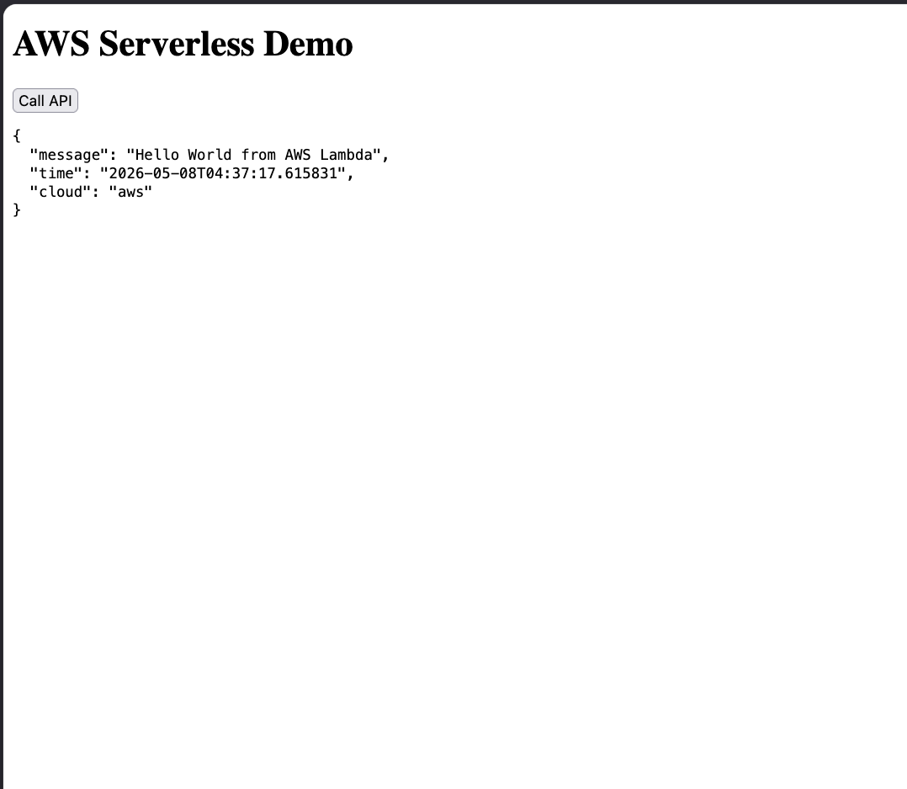

# AWS Serverless Demo

Serverless cloud application built using Terraform, AWS Lambda, API Gateway, and Amazon S3 static website hosting.

This project explores multiple cloud deployment models and infrastructure-as-code principles while demonstrating when different AWS services are appropriate for different application requirements.

---

# Architecture

S3 Static Frontend → API Gateway → AWS Lambda

The frontend is hosted as a static website in S3 and communicates with a Python-based 
AWS Lambda function through API Gateway.

                ┌─────────────────────┐
                │     User Browser    │
                └──────────┬──────────┘
                           │
                           ▼
                ┌─────────────────────┐
                │   S3 Static Website │
                │     index.html      │
                └──────────┬──────────┘
                           │ fetch()
                           ▼
                ┌─────────────────────┐
                │    API Gateway      │
                │  HTTP API Endpoint  │
                └──────────┬──────────┘
                           │
                           ▼
                ┌─────────────────────┐
                │    AWS Lambda       │
                │ Python Function API │
                └─────────────────────┘
                           │
                           ▼
                ┌─────────────────────┐
                │ CloudWatch Logs     │
                └─────────────────────┘

Browser requests are served through Amazon S3 static hosting. Frontend API calls are routed through API Gateway, which invokes a Python AWS Lambda function. CloudWatch is used for serverless logging and monitoring.

---

# Technologies Used

- Terraform
- AWS Lambda
- API Gateway
- Amazon S3
- Amazon CloudWatch
- Python 3.11
- JavaScript
- HTML

---

# Features

- Serverless Python backend
- Static website hosting with S3
- Public serverless HTTP API using API Gateway
- Infrastructure managed with Terraform
- Frontend-to-backend communication using fetch()
- CORS configuration for browser API access

---

# Demo



---

# Why Different Deployment Models Matter

This project was built to understand how different AWS services solve different problems.

## EC2
Best for:
- full server control
- long-running applications
- custom environments

Tradeoffs:
- manual server management
- scaling complexity
- patching and maintenance responsibilities

## Lambda
Best for:
- lightweight APIs
- event-driven workloads
- serverless architectures

Benefits:
- automatic scaling
- lower operational overhead
- pay-per-request pricing

## S3 Static Hosting
Best for:
- static websites
- SPAs
- frontend hosting

Benefits:
- low cost
- high availability
- minimal infrastructure management

---

# Infrastructure Components

## AWS Lambda
Runs Python application code without managing servers.

## API Gateway
Provides public HTTP endpoints and routes requests to Lambda.

## S3
Hosts the frontend static website.

## Terraform
Provisions and manages all infrastructure resources.

---

# Project Structure

```text
aws-serverless-demo/
│
├── lambda_function.py
├── lambda_function.zip
├── main.tf
├── index.html
└── README.md
```

---

# Deployment

## Initialize Terraform

```bash
terraform init
```

## Deploy Infrastructure

```bash
terraform apply
```

## Package Lambda Changes

After updating lambda_function.py:

```bash
zip lambda_function.zip lambda_function.py
terraform apply
```

---

# Lessons Learned

- Infrastructure as Code with Terraform
- AWS IAM permissions and roles
- API Gateway integrations
- Lambda deployment packaging
- CORS configuration
- Static website hosting with S3
- Cloud architecture tradeoffs
- Debugging distributed cloud systems
- Terraform state management and deployment workflows

---

# Security Considerations

This project also introduced several important cloud security concepts:

- IAM role-based permissions between AWS services
- AWS S3 Block Public Access protections
- CORS configuration between frontend and backend services
- Public vs private cloud resource exposure
- Principle of least privilege considerations for serverless infrastructure

For demo simplicity, some configurations (such as open CORS origins and public S3 access) were intentionally permissive. In production environments, these settings would be more tightly restricted. This project reinforced the importance of security-first thinking when designing cloud infrastructure and public-facing services.

---

# Future Improvements

- Multi-cloud deployment using Azure Functions
- Multi-cloud infrastructure
- CI/CD pipeline integration
- Custom domain configuration
- Authentication and authorization
- Docker-based packaging

---

# Author

Dan Maynez
Built as a cloud/serverless infrastructure learning project.